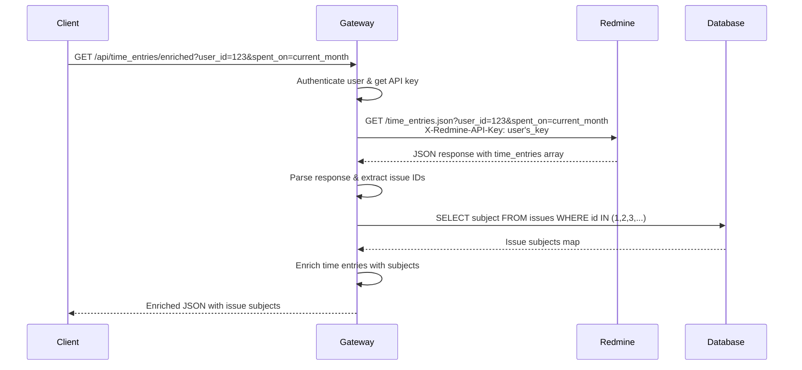

# Get Enriched Time Entries

## Overview

The enriched time entries endpoint enhances Redmine's standard time entries API by adding issue subjects directly to each time entry. This solves a common problem where the standard Redmine API only returns issue IDs without their corresponding subjects, making it difficult for users to understand what work was done without additional API calls.

## Sequence Diagram



## Request

```http
GET /api/time_entries/enriched?user_id={user_id}&spent_on=m
```

Since this service supports both open source Redmine and Easy Redmine, there is a difference in how both solutions handle the `spent_on` parameter. Check the documentation for the exact variable values.

| `spent_on` | OSS Redmine | Easy Redmine |
|------------|-------------|--------------|
| Today | `t` | `today` |
| This week | `w` | `current_week` |
| This month | `m` | `current_month` |
| This year | `y` | `current_year` |

`user_id` - The ID of the user whose time entries to retrieve. Use `me` to get the current authenticated user's time entries.

### Authorization

Requires a valid OAuth access token in the Authorization header (Bearer token)

### Example

```bash
curl -X GET "http://localhost:8080/api/time_entries/enriched?user_id=me&spent_on=m" \
  -H "Authorization: Bearer YOUR_ACCESS_TOKEN"
```

## Response

JSON array containing the list of assignable users and groups:

```json
{
    "time_entries": [
        {
            "id": int,
            "project": {
                "id": int,
                "name": "string"
            },
            "issue": {
                "id": int,
                "subject": "string"
            },
            "user": {
                "id": int,
                "name": "string"
            },
            "activity": {
                "id": int,
                "name": "string"
            },
            "hours": number,
            "comments": "string",
            "spent_on": "string",
            "created_on": "string",
            "updated_on": "string"
        }
    ],
    "total_count": int,
    "offset": int,
    "limit": int
}
```

| Property | Type | Description |
|----------|------|-------------|
| `time_entries` | array | Array of enriched time entry objects |
| `time_entries[].id` | int | Unique identifier of the time entry |
| `time_entries[].project.id` | int | Unique identifier of the project |
| `time_entries[].project.name` | string | Name of the project |
| `time_entries[].issue.id` | int | Unique identifier of the issue/task |
| `time_entries[].issue.subject` | string | **Added by enrichment** - Subject/title of the issue |
| `time_entries[].user.id` | int | Unique identifier of the user who logged the time |
| `time_entries[].user.name` | string | Full name of the user |
| `time_entries[].activity.id` | int | Unique identifier of the activity type |
| `time_entries[].activity.name` | string | Name of the activity (e.g., "Development", "Testing") |
| `time_entries[].hours` | number | Number of hours spent (can be decimal) |
| `time_entries[].comments` | string | Optional comments/description for the time entry |
| `time_entries[].spent_on` | string | Date when the work was performed (YYYY-MM-DD) |
| `time_entries[].created_on` | string | Timestamp when the time entry was created (ISO 8601) |
| `time_entries[].updated_on` | string | Timestamp when the time entry was last updated (ISO 8601) |
| `total_count` | int | Total number of time entries matching the query |
| `offset` | int | Pagination offset (number of results skipped) |
| `limit` | int | Maximum number of results per page |

### Example Response

```json
{
    "time_entries": [
        {
            "id": 1,
            "project": {
                "id": 1,
                "name": "Project Alpha"
            },
            "issue": {
                "id": 123,
                "subject": "Implement user authentication"
            },
            "user": {
                "id": 456,
                "name": "John Doe"
            },
            "activity": {
                "id": 1,
                "name": "Development"
            },
            "hours": 2.5,
            "comments": "Working on login functionality",
            "spent_on": "2024-01-15",
            "created_on": "2024-01-15T10:30:00Z",
            "updated_on": "2024-01-15T10:30:00Z"
        }
    ],
    "total_count": 1,
    "offset": 0,
    "limit": 25
}
```
